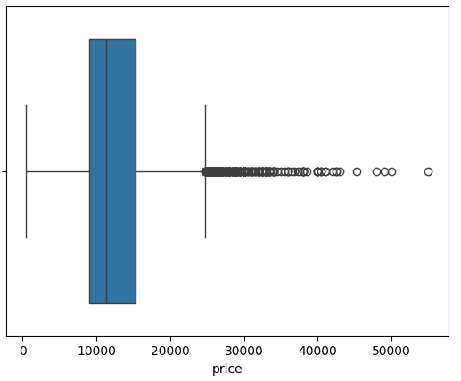
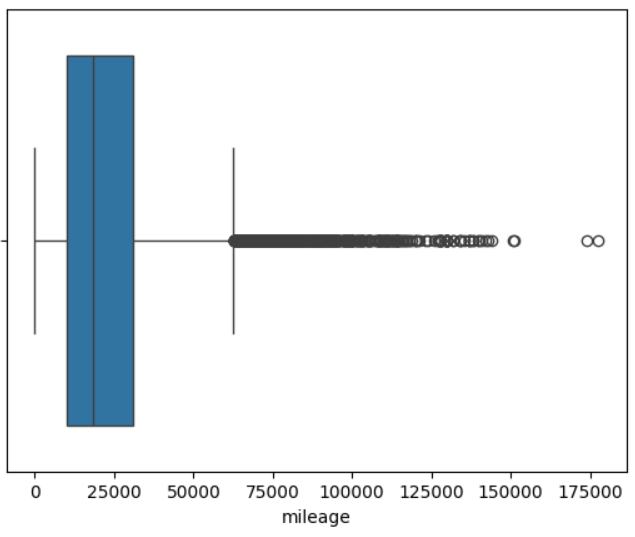
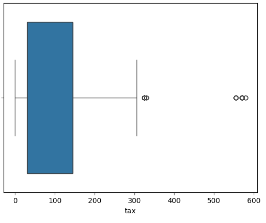
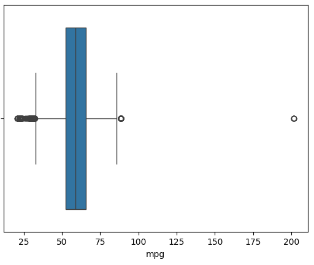
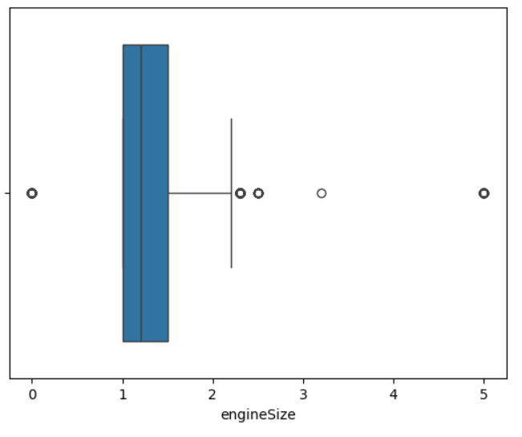
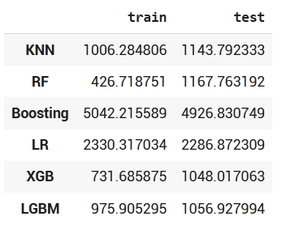

# Laporan Proyek Machine Learning - Raihan Akbar

## Proyek Prediksi Harga Mobil (Car Price Prediction)

Abstracts

**Introduction**:

Ketika seseorang ingin membeli sebuah mobil terutama mobil bekas ada banyak hal penting yang harus dipertimbangkan. Karena dalam pembelian mobil bekas, kondisi yang ada sangat mempengaruhi harga. Secara umum, faktor-faktor yang mempengaruhi sangat bervariasi seperti, efisiensi bahan bakar dan dampak lingkungan, usia, klasifikasi, ukuran, warna, dan kapasitas mobil menjadi hal yang diperhatikan dan dipertimbangkan dalam mengambil keputusan membeli suatu mobil bekas (Jiang, 2024).

Akses ke internet telah meningkat dalam beberapa tahun terakhir, meningkatkan jumlah informasi yang tersedia bagi calon pembeli di berbagai pasar. Sekarang konsumen dapat mengakses berbagai informasi tentang barang dan jasa untuk membantu mereka membuat keputusan pembelian yang lebih baik. Jenis data ini dapat membantu mengurangi kesenjangan informasi antara pembeli dan penjual. Misalnya, penjual dan pembeli biasanya setuju tentang harga mobil. Namun, pembeli mungkin perlu lebih konsisten dalam pengetahuan dan keterampilan mereka (Pillai, 2022).

**Referensi:**

[1. Research for Car Price Prediction Base on Machine Learning (Jiang, 2024)](https://www.researchgate.net/publication/383113686_Research_for_Car_Price_Prediction_Base_on_Machine_Learning)

[2. Used Car Price Prediction Based on the Iterative Framework of XGBoost+LightGBM](https://www.researchgate.net/publication/367594417_Used_Car_Price_Prediction_Based_on_the_Iterative_Framework_of_XGBoostLightGBM)

[3. A Deep Learning Approach for Used Car Price Prediction (Pillai, 2022)](https://www.researchgate.net/profile/Aravind-Sasidharan-Pillai/publication/379035407_A_Deep_Learning_Approach_for_Used_Car_Price_Prediction)

[4. Price Prediction for Pre-Owned Cars Using Ensemble Machine Learning Techniques (Longani et al., 2021)](https://www.sciencegate.app/document/10.3233/apc210194#:~:text=Ensemble%20techniques%20in%20machine%20learning%20namely%20Random%20Forest,compared%20so%20as%20to%20determine%20an%20optimal%20one.)

## Business Understanding

### Problem Statements

Melihat pada pembahasan sebelumnya, ada beberapa problem statement yang dapat diambil:

**1. Ketidakpastian Penentuan Harga Mobil Bekas**

Meskipun terdapat banyak faktor yang mempengaruhi harga mobil bekas dan ketersediaan informasi online yang meningkat, masih terdapat ketidakpastian dan potensi inkonsistensi dalam penentuan harga yang adil dan akurat bagi pembeli dan penjual.

**2. Memanfaatkan Informasi Online untuk Penilaian Mobil Bekas yang Konsisten**

Dengan banyaknya informasi yang tersedia secara online, muncul tantangan dalam memilah, memvalidasi, dan memanfaatkan informasi tersebut secara efektif untuk mendapatkan penilaian harga mobil bekas yang konsisten dan dapat diandalkan.

### Goals

Dengan adanya problem statement yang ada, ada beberapa tujuan yang akan dicapai dalam penelitian ini:

1. **Mengembangkan atau mengidentifikasi metode yang lebih objektif dan akurat** untuk menentukan harga mobil bekas berdasarkan data riwayat penjualan mobil bekas.

2. **Meningkatkan pemahaman pembeli dan penjual** mengenai faktor-faktor penentu harga mobil bekas yang sebenarnya.

### Solution Statements

Beberapa solusi yang akan diberikan yaitu:

1. **Melakukan perbandingan model machine learning untuk memprediksi harga mobil** seperti model K-Nearest Neighbors (KNN), Random Forest (RF), Gradient Boosting (Boosting), Linear Regression (LR), XGBoost (XGB), dan LightGBM (LGBM).

1. **Melakukan Exploratory Data Analysis (EDA) untuk mendapatkan informasi dari data yang ada** sehingga dapat mengetahui hubungan fitur-fitur yang ada dengan harga mobil.

## Data Understanding

Pada penelitian ini, peneliti menggunakan dataset yang berasal dari platform Kaggle yaitu **"Ford Car Price Prediction"** yang berisi informasi mengenai berbagai mobil Ford bekas yang dijual. Dataset ini mencakup informasi mengenai fitur-fitur penting seperti model mobil, tahun pembuatan, harga, jenis transmisi, jarak tempuh (mileage), jenis bahan bakar, besaran pajak, efisiensi bahan bakar (mpg), dan ukuran mesin.

**Sumber Dataset:**

[Kaggle - Ford Car Price Prediction](https://www.kaggle.com/datasets/adhurimquku/ford-car-price-prediction).

### Exploratory Data Analysis (EDA):

Dalam melakukan Exploratory Data Analysis (EDA) ada beberapa hal yang dilakukan :

**1. Deskripsi Variabel**

Berdasarkan informasi dari dataset Ford Car Price Prediction, berikut ini penjelasan tentang deskripsi dari variabel-variabel yang ada sebagai berikut:

1. **model** -> Kolom ini berisi berbagai model atau jenis mobil yang diproduksi oleh merek Ford.

2. **year** -> Kolom ini menunjukkan tahun kapan mobil tersebut diproduksi atau dibuat. Informasi ini penting untuk mengetahui usia mobil.

3. **price** -> Kolom ini mencantumkan harga jual mobil dalam mata uang Dollar Amerika Serikat.

4. **transmission** -> Kolom ini mengindikasikan jenis sistem transmisi yang digunakan oleh mobil. Terdapat tiga pilihan, Automatic, Manual, Semi-Auto

5. **mileage** -> Jumlah Mil yang Telah Ditempuh: Kolom ini mencatat total jarak yang telah ditempuh oleh mobil, diukur dalam satuan mil. Ini sering menjadi indikator seberapa sering dan jauh mobil telah digunakan.

6. **fuel_Type** -> Kolom ini menjelaskan jenis bahan bakar yang digunakan oleh mobil, Petrol, Diesel, Hybrid, Electric, Other

7. **tax** -> Kolom ini menunjukkan besaran pajak tahunan yang harus dibayarkan untuk mobil tersebut.

8. **mpg** -> Kolom ini mengukur efisiensi bahan bakar mobil, yaitu seberapa jauh mobil dapat menempuh perjalanan (dalam mil) dengan satu galon bahan bakar. Angka yang lebih tinggi menunjukkan mobil yang lebih hemat bahan bakar.

9. **engineSize** -> Kolom ini menunjukkan kapasitas atau ukuran mesin mobil, biasanya diukur dalam liter (L).

Semua kolom memiliki **17.966 nilai non-null**, menandakan tidak ada data yang hilang.

**2. Menangani Outliers**

Pada tahapan selanjutnya, peneliti mencoba untuk mendeteksi outliers dengan teknik visualisasi data (boxplot). Kemudian peneliti akan menangani outliers dengan teknik IQR method. Berikut ini hasil boxplot dari beberapa variable yang ada:

Berdasarkan boxplot pada beberapa variabel yang ada, ada beberapa data yang berperan menjadi outlier. Penanganan outlier dengan menggunakan IQR Method dilakukan untuk menghapus data yang kurang relevan sehingga menjaga validitas pada pelatihan model klasifikasi atau meningkatkan kualitas prediksi pada proses selanjutnya. Setelah menghapus data yang mengandung outlier, data tersisa 16.448 data.

**3. Univariate Analysis**

Tahap selanjutnya dalam proses EDA yaitu melakukan Univariate Analysis yaitu teknik analisis data yang fokus pada pemeriksaan dan deskripsi satu variabel tunggal pada suatu waktu. Pada tahapan ini akan dibagi menjadi dua fitur yaitu numerical features dan categorical features.

**a. Categorical Features**

- Model

Berdasarkan gambar diatas, didapati bahwa model **Fiesta** menjadi model yang paling banyak terjual dengan total 6.198 dan disusul model **Focus** dengan 4.171 dan model **Kuga** dengan 2.065. Selain itu juga banyak model lain yang terjual namun tidak sebanyak 3 model mobil sebelumnya.

- Transmission

Berdasarkan gambar diatas, transmission yang paling banyak adalah Manual dengan 87% dari total data yang ada. Hal ini menunjukkan model mobil dengan transmission Manual merupakan model yang paling laku dipasaran.

- Fuel Type

Berdasarkan gambar diatas dari tipe bahan bakar yang banyak digunakan, Petrol mendominasi dengan 11477 dan disusul oleh Diesel dengan 4960. Kedua tipe ini lebih dominan dibandingkan dengan tipe lain seperti Hybrid dan Electric. Hal ini menunjukkan bahwa pada masa itu kendaraan listrik belum begitu populer di kalangan masyarakat.

**b. numerical features**

Berikut ini penjelasan masing-masing histogram:

1. Sebagian besar mobil dalam dataset ini diproduksi antara tahun 2016 dan 2019, dengan tahun 2017 menjadi tahun produksi terbanyak. Jumlah mobil dari tahun-tahun yang lebih tua atau lebih baru cenderung lebih sedikit dalam dataset ini.
2. Sebagian besar mobil dalam dataset ini memiliki harga di kisaran yang lebih rendah, dengan sejumlah kecil mobil yang memiliki harga premium atau mewah.
3. Sebagian besar mobil dalam dataset ini memiliki jarak tempuh yang relatif rendah, menunjukkan bahwa banyak mobil mungkin masih relatif baru atau tidak terlalu sering digunakan.
4. Sistem atau aturan perpajakan untuk mobil-mobil ini kemungkinan memiliki beberapa tingkatan atau kelompok tarif pajak yang berbeda, menyebabkan konsentrasi jumlah mobil pada nilai-nilai pajak tertentu.
5. Penggunaan bahan bakar mobil dalam dataset ini terkumpul di beberapa rentang tertentu, menunjukkan adanya berbagai jenis transmission yang menghasilkan tingkat efisiensi yang berbeda. Puncak di sekitar 60-65 mpg menunjukkan rentang efisiensi yang paling umum.
6. Ukuran mesin mobil dalam dataset ini terkonsentrasi pada beberapa nilai tertentu, terutama 1.0, diikuti oleh 1.6 dan 2.0. Ukuran mesin lainnya kurang umum dalam dataset ini.

**4. Multivariate Analysis**

**Categorical Features**

Ada tiga buah bar plot yang memvisualisasikan rata-rata harga (price) mobil berdasarkan tiga variabel kategorikal yang berbeda, model, transmission, dan fuelType. Berikut ini detail penjelasannya:

**1. Rata-rata harga berdasarkan model mobil**

- Beberapa model seperti Edge, Tourneo Custom, dan Galaxy cenderung memiliki rata-rata harga yang jauh lebih tinggi dibandingkan model lain seperti KA, Fiesta, dan Focus.

- Model seperti Puma, Kuga, Mondeo, S-MAX, B-MAX, Tourneo Connect, dan Grand C-MAX berada di kisaran harga menengah.

**2. Rata-rata Harga Berdasarkan Jenis Transmisi**

- Mobil dengan transmisi Automatic cenderung memiliki rata-rata harga yang lebih tinggi dibandingkan mobil dengan transmisi Manual.
- Mobil dengan transmisi Semi-Auto memiliki rata-rata harga yang paling tinggi di antara ketiganya.

**3. Rata-rata Harga Berdasarkan Jenis Bahan Bakar**

- Mobil dengan bahan bakar Hybrid memiliki rata-rata harga yang paling tinggi secara signifikan dibandingkan jenis bahan bakar lainnya dalam dataset ini.
- Mobil dengan bahan bakar Electric juga memiliki rata-rata harga yang cukup tinggi, meskipun sedikit di bawah Hybrid.
- Mobil dengan bahan bakar Petrol dan Diesel memiliki rata-rata harga yang relatif mirip dan lebih rendah dibandingkan Hybrid dan Electric.

**Numerical Features**

Gambar ini menampilkan sebuah pair plot yang dibuat menggunakan library seaborn. Pair plot sangat berguna untuk memvisualisasikan hubungan antara pasangan variabel numerik dalam sebuah dataset. Dalam kasus ini,variabel - variabel numerik yang dianalisis adalah 'year', 'price', 'mileage', dan 'tax', mpg, dan engineSize.

**Correlation Matrix**

Pada gambar diatas menampilkan sebuah Correlation Matrix (Matriks Korelasi) yang divisualisasikan menggunakan heatmap. Matriks ini menunjukkan koefisien korelasi antara pasangan fitur-fitur numerik dalam dataset mobil. Beberapa fitur menunjukkan korelasi yang cukup kuat (misalnya, tahun dengan harga dan jarak tempuh), sementara yang lain memiliki korelasi yang lemah.

## Data Preparation

Pada bagian ini, peneliti melakukan beberapa tahapan yaitu melakukan encoding fitur kategori, pembagian dataset, dan melakukan standarisasi sehingga siap digunakan untuk pelatihan pada model yang dirancang.

**Encoding Fitur Kategori**:

**_One-hot encoding_** adalah teknik yang umum digunakan untuk mengubah data kategorikal menjadi format numerik yang dapat dipahami oleh sebagian besar algoritma machine learning. Setiap kategori dalam sebuah fitur kategorikal diubah menjadi kolom biner (0 atau 1) atau true dan false. Ini mencegah algoritma mengasumsikan adanya urutan atau jarak antara kategori (seperti yang mungkin terjadi jika kita hanya memberikan label numerik pada kategori).

**Pembagian Dataset**
Pada tahapan ini, peneliti melakukan pembagian dataset menjadi data pelatihan (train) dan data pengujian (test). Dataset akan dibagi menjadi fitur (X) yang berisi semua kolom kecuali 'price', dan target (y) yang hanya berisi kolom 'price'. Selanjutnya, dengan menggunakan fungsi **train_test_split** membagi data ini menjadi set pelatihan (80% untuk X_train dan y_train) yang akan digunakan untuk melatih model, dan set pengujian (20% untuk X_test dan y_test) yang akan digunakan untuk mengevaluasi performa model pada data yang belum pernah dilihat, dengan random_state=123 memastikan pembagian data yang konsisten untuk reproduktibilitas. Dengan total masing-masing dataset yang sudah dibagi sebagai berikut:

Total sample in whole dataset: 17966

Total sample in train dataset: 14372

Total sample in test dataset: 3594

**Standarisasi**

Tahapan ini dilakukan bertujuan untuk melakukan standardisasi pada fitur-fitur numerik tertentu ('year', 'mileage', 'tax', 'mpg', 'engineSize') dalam set pelatihan (X_train). Standardisasi dilakukan menggunakan **StandardScaler** dari scikit-learn, yang menghitung mean dan standar deviasi dari setiap fitur numerik dalam X_train, kemudian mentransformasikan nilai-nilai fitur tersebut sehingga memiliki mean mendekati nol dan standar deviasi mendekati satu. Proses ini penting untuk memastikan bahwa fitur-fitur numerik dengan skala yang berbeda tidak memberikan pengaruh yang tidak proporsional pada model machine learning dan dapat membantu algoritma konvergen lebih cepat.

## Modeling

Tahapan ini membahas mengenai model machine learning yang digunakan untuk menyelesaikan permasalahan. Ada beberapa model yang dirancang seperti KNN, Random Forest, AdaBoost, Linear Regression, XGBoost, dan LightGBM.

### Perbandingan Kelebihan dan Kekurangan Model

| Model             | Kelebihan                                                                                                                                                                                                                                                         | Kekurangan                                                                                                                                                                                            |
| ----------------- | ----------------------------------------------------------------------------------------------------------------------------------------------------------------------------------------------------------------------------------------------------------------- | ----------------------------------------------------------------------------------------------------------------------------------------------------------------------------------------------------- |
| KNN               | Sederhana dan mudah diimplementasikan. Tidak membuat asumsi kuat tentang distribusi data. Berguna untuk data yang memiliki pola kompleks jika jumlah tetangga dipilih dengan tepat. Dapat digunakan untuk klasifikasi dan regresi.                                | Sensitif terhadap skala fitur. Perlu menentukan nilai K yang optimal. Komputasi mahal untuk dataset besar (terutama saat prediksi). Tidak efektif pada data dimensi tinggi (curse of dimensionality). |
| Random Forest     | Akurasi yang baik dan robust terhadap overfitting. Dapat menangani data dengan fitur yang banyak dan berinteraksi. Memberikan ukuran pentingnya fitur. Paralelisasi mudah. Tidak terlalu sensitif terhadap outlier.                                               | Model yang dihasilkan bisa sulit diinterpretasikan (dibandingkan decision tree tunggal). Membutuhkan lebih banyak sumber daya komputasi dan waktu pelatihan dibandingkan decision tree tunggal.       |
| AdaBoost          | Meningkatkan akurasi model lemah secara iteratif. Fokus pada sampel yang sulit diklasifikasikan. Robust terhadap outlier dan tidak memerlukan tuning parameter yang banyak.                                                                                       | Sensitif terhadap noisy data dan outlier yang ekstrem. Rentan terhadap overfitting jika model lemah terlalu kompleks atau jumlah iterasi terlalu banyak.                                              |
| Linear Regression | Sederhana, mudah diinterpretasikan. Komputasi relatif murah. Bekerja baik jika hubungan antara fitur dan target linear.                                                                                                                                           | Mengasumsikan hubungan linear antara fitur dan target. Sensitif terhadap outlier. Perlu mengatasi multikolinearitas antar fitur. Tidak dapat menangkap hubungan non-linear tanpa transformasi fitur.  |
| XGBoost           | Performa yang sangat baik dan seringkali memenangkan kompetisi machine learning. Efisien dalam penggunaan memori dan waktu komputasi. Regularisasi bawaan untuk mencegah overfitting. Menangani nilai yang hilang secara implisit. Mendukung parallel processing. | Lebih sulit untuk di-tune dibandingkan beberapa algoritma lain karena memiliki banyak parameter. Model yang kompleks bisa menjadi kurang interpretable.                                               |
| LightGBM          | Sangat efisien dan cepat dalam pelatihan. Penggunaan memori lebih rendah dibandingkan XGBoost pada dataset besar. Mendukung parallel processing. Secara default menangani fitur kategorikal dengan baik. Kurang rentan terhadap overfitting pada beberapa kasus.  | Lebih sensitif terhadap overfitting pada dataset kecil jika parameter tidak di-tune dengan hati-hati. Bisa kurang akurat dibandingkan XGBoost pada dataset yang sangat kecil.                         |

### Parameter yang digunakan pada setiap Model Algoritma

| Model             | Parameter yang digunakan                                  |
| ----------------- | --------------------------------------------------------- |
| KNN               | n_neighbors=10                                            |
| Random Forest     | n_estimators=50, max_depth=16, random_state=55, n_jobs=-1 |
| AdaBoost          | learning_rate=0.001, random_state=55                      |
| Linear Regression | -                                                         |
| XGBoost           | -                                                         |
| LightGBM          | -                                                         |

## Evaluation

Pada bagian ini peneliti akan melakukan evaluasi pada model yang sudah dilatih sebelumnya dengan menggunakan Mean Square Error (MSE) dan R Squared (R²).

| Matriks Evaluasi        | Rumus Matematis                                                      | Definisi                                                                                                                                                                                                                                                                                                                      | Kelebihan                                                                                                                                                                                                                                 | Kekurangan                                                                                                                                                                                  |
| ----------------------- | -------------------------------------------------------------------- | ----------------------------------------------------------------------------------------------------------------------------------------------------------------------------------------------------------------------------------------------------------------------------------------------------------------------------- | ----------------------------------------------------------------------------------------------------------------------------------------------------------------------------------------------------------------------------------------- | ------------------------------------------------------------------------------------------------------------------------------------------------------------------------------------------- |
| Mean Square Error (MSE) |       | Mean Squared Error (MSE) adalah salah satu metrik evaluasi yang paling umum digunakan untuk mengukur kinerja model regresi. Secara sederhana, MSE menghitung rata-rata dari kuadrat selisih antara nilai prediksi model dengan nilai sebenarnya (nilai target).                                                               | Memberikan penalti yang lebih besar untuk kesalahan prediksi yang besar karena adanya operasi kuadrat. Ini menjadikannya sensitif terhadap outlier yang menghasilkan kesalahan besar.                                                     | Sangat sensitif terhadap outlier. Sebuah prediksi yang sangat jauh dari nilai sebenarnya akan memberikan kontribusi kuadrat yang besar terhadap nilai MSE.                                  |
| R-Squared (R²)          |  | R-squared, juga dikenal sebagai koefisien determinasi, adalah metrik evaluasi yang mengukur seberapa baik variabilitas variabel dependen (target) dapat dijelaskan oleh model regresi. Dengan kata lain, R-squared menunjukkan proporsi varians dalam variabel target yang dapat diprediksi dari variabel independen (fitur). | Lebih mudah diinterpretasikan daripada MSE karena nilainya berada dalam skala 0 hingga 1, yang merepresentasikan proporsi varians yang dijelaskan dan dapat memberikan indikasi seberapa baik model cocok dengan data secara keseluruhan. | Tidak menunjukkan apakah model bias atau tidak. Model dengan R-squared tinggi masih bisa menghasilkan prediksi yang secara sistematis lebih tinggi atau lebih rendah dari nilai sebenarnya. |

### Hasil Mean Square Error (MSE)

Berdasarkan nilai MSE pada data pengujian:

1. XGBoost dan LGBM menunjukkan performa terbaik dalam melakukan generalisasi ke data yang belum pernah dilihat.
2. KNN dan Random Forest mengalami overfitting yang cukup besar, di mana performa pada data pelatihan jauh lebih baik daripada pada data pengujian.
3. Boosting dan Linear Regression memiliki nilai MSE yang lebih tinggi secara keseluruhan, yang mungkin mengindikasikan bahwa model tersebut tidak cukup kompleks untuk menangkap pola dalam data dengan baik.

### Hasil R-Squared (R²)

Berdasarkan nilai R² pada data pengujian:

1. XGBoost dan LGBM menunjukkan performa terbaik dalam menjelaskan varians harga pada data yang belum pernah dilihat. Random Forest juga sangat baik.
2. Sebagian besar model menunjukkan generalisasi yang cukup baik karena nilai R² pada data pengujian tidak jauh berbeda dari nilai pada data pelatihan.
3. Boosting dan Linear Regression memiliki nilai R² yang lebih rendah dibandingkan model lainnya, menunjukkan bahwa mereka tidak menjelaskan varians dalam harga sebaik model-model tree-based atau berbasis tetangga.

Secara keseluruhan, berdasarkan metrik R², model XGBoost, LightGBM, dan Random Forest tampaknya menjadi pilihan terbaik untuk memprediksi harga mobil dalam dataset ini. Mereka mampu menjelaskan sebagian besar varians dalam harga dan menunjukkan kemampuan generalisasi yang baik.

**Visualisasi Mean Square Error (MSE)**

Berdasarkan visualisasi diatas, LGBM dan XGBoost menunjukkan performa terbaik dalam melakukan generalisasi ke data yang belum pernah dilihat (MSE terendah pada batang oranye). Random Forest (RF) menunjukkan overfitting yang jelas karena MSE pada data pelatihan sangat rendah, tetapi meningkat tajam pada data pengujian. KNN juga menunjukkan indikasi overfitting.

Boosting dan Linear Regression (LR) memiliki performa prediksi yang kurang baik secara keseluruhan (MSE tinggi pada test set). Untuk tugas regresi ini, LGBM dan XGBoost tampaknya menjadi pilihan model yang lebih baik karena memiliki MSE yang rendah pada data pengujian dan menunjukkan generalisasi yang baik (perbedaan kecil antara train dan test MSE).

## Conclusion

test
